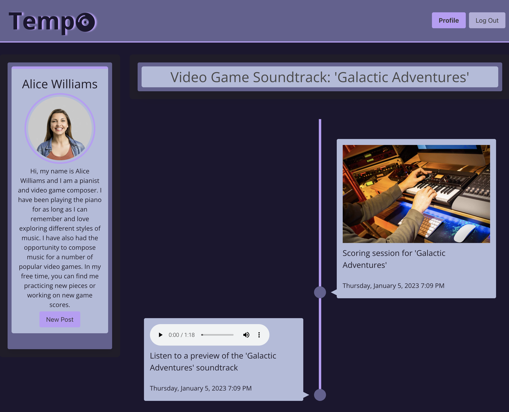

# Tempo
 

 *A social media site designed for musicians to showcase their work and creative process.*

 ## Table of Contents

 - [Background](#background)
 - [Install](#install)
 - [Usage](#usage)
 - [Screenshot](#screenshot)
 - [Technologies](#technologies)
 - [Creators](#creators)
 - [Contributors](#contributors)
 - [License](#license)
 - [Credits](#credits)
 - [Questions](#questions)

 ## Background

 The music world is changing. Artists are empowering themselves and gaining autonomy in the music industry by taking power back from greedy record labels. By creators for creators, ***Tempo*** brings the musician to the forefront. Join a new wave of artists sharing their creative process, identify a self-brand, and getting inspired by other creators from around the globe. With ***Tempo***, you can share your work, get inspired by other creators, and find new opportunities for collaboration and growth. 

 ## Install
 #### Link to Webpage 🔗:

 https://desolate-castle-93204.herokuapp.com/

 ## Usage

 ***Tempo*** is an online social media platform designed specifically for musicians. Creators can post content related to their work and their creative process. 

 ## Screenshot

 

 ## Technologies

 - Bcrypt
 - Cloudinary
 - Express
 - Handlebars
 - Mysql2
 - Sequelize

 ## Creators

 [@Justin Pauldo](https://github.com/KingdomSeeker328).
 [@Chelsea Runacres](https://github.com/ChelsRunnn).
 [@Danny Bedrossian](https://github.com/dbedrossian).

 ## Contributors

 Special thanks to Leif Hetland and Eric Kim for help with Cloudinary.

 ## License

 

## Credits

- *Music from:* Pixabay by Daddy's Music, Coma Media, OYStudio, noisysymphony, artist 22941069

- *Photo by:* cottonbro studio
 
 ## Questions

 For questions, contact us on [@Github](https://github.com/KingdomSeeker328).